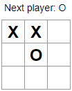

# 
 Jogo da velha 

 

  

 

## 💻 Projeto

Jogo da velha em React.

## 💻 Tecnologias

Esse projeto foi desenvolvido com as seguintes tecnologias:

- ReactJS
- JavaScript
- HTML
- CSS

 
## 🚀 Para executar:

### Requisitos

- Você vai precisar instalar o [Node.js](https://nodejs.org/en/download/) e o NPM no seu projeto.

* Clone o projeto
* Instale as dependências com npm
* Inicie o projeto com npm start

O aplicativo estará disponível para acesso em `http://localhost:3000/`

-----------------------------------------------------------------

Esse projeto foi feito utilizando o tutorial incial do React.
